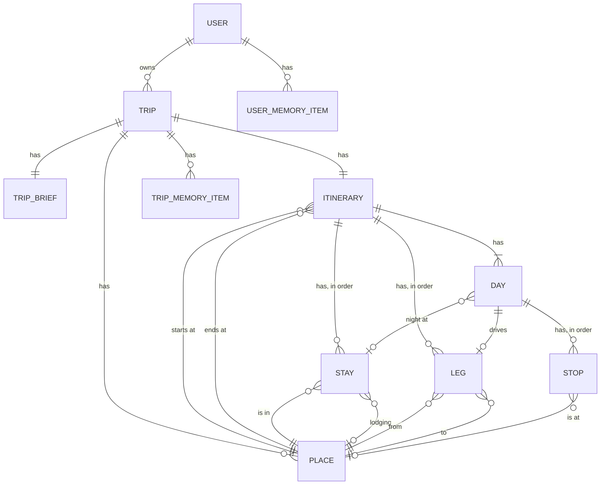

# Road Trip Planner: Technical Specification (MVP)

This document covers how the app works under the hood. So far it covers the agents: which agents exist, what each one does, which tools each one gets, and what goes in each agent's instructions. Sessions, memory, and other parts will be added as they are designed. It is written at the level of design, not of any one SDK's configuration. For the planning behavior it implements, see the [functional spec](functional-spec.md). For the tools' data sources, see the [data sources index](data-sources.md).

---

## 1. Overview

One **coordinator** agent talks to the user for the whole trip. It sends research to **worker** subagents and keeps the conversation, the itinerary's structure, and memory to itself.

| Agent | Talks to the user | Writes the itinerary | Writes memory | Runs |
|---|---|---|---|---|
| Coordinator | Yes | Yes | Yes | For the whole session |
| Stay researcher | No | Adds candidates only | No | Once per stay, in parallel |
| Leg scout | No | Adds candidates only | No | Once per leg, in parallel |
| Weather and clothing | No | No | No | Once per trip, after the fill round |

A worker is called like a tool. It gets a brief, does its work, and returns one result. It can't ask the user anything. If it needs a decision, it says so in its result, and the coordinator asks.

---

## 2. Decisions

- **No separate interview agent, for now.** We considered an agent that scopes the trip with the user, then hands a summary to the coordinator once and ends. Discovery and refinement mix too often for a split to pay off yet (functional spec 5.3: the user can jump around). Revisit it if the coordinator's discovery turns out weak. If it is added later, the summary it hands over is the trip brief in section 5.3, so the coordinator doesn't change.
- **Workers write candidates directly and return a short summary.** Full place details go on the place, and from there to the option cards. The coordinator sees only one line per candidate (section 7).
- **Mechanical feasibility checks run in code.** The itinerary write tool checks every change and returns any broken rules (section 8). The agent handles the judgment: which trade-offs to offer.
- **The coordinator resolves budget rules into a tier before briefing a worker.** A worker gets "mid-range, from rule: 2+ nights", never the rule text (section 9).

---

## 3. Data model

This section lists what gets stored, how the pieces relate, and who creates or changes each one. Fields are settled during development.

**Every entity's ID is one we create.** IDs from outside sources, such as Google's place ID, are stored as ordinary properties and can be empty.

### 3.1 Entities



How to read the line ends: `||` is exactly one, `o|` is zero or one, `o{` is zero or more, and `|{` is one or more. For example, `DAY ||--o| LEG` means a day has zero or one leg, and every leg belongs to exactly one day.

Candidates are not in the diagram. They are value objects held inside stops and stays (3.2).

| Entity | Belongs to | What it is |
|---|---|---|
| Trip | User | The container for everything below. The app creates it when the user starts a new conversation (functional spec 10.1) |
| Trip brief | Trip | The items in functional spec 5.2. Created empty with the trip |
| Itinerary | Trip | Points to a start place and an end place. Holds the stays, legs, and days. Created empty with the trip |
| Place | Trip | Any real location: a town, hotel, restaurant, bar, attraction, friend's house, or campground. Holds the facts about it: name, coordinates, Google's place ID when there is one, and the details a tool returned, such as rating, review count, price level, weekly hours, summary, and links. The kind of place doesn't limit how it's used. A hotel can be a stay's lodging, or a stop for its bar. On a loop, the start and end are the same place |
| Stay | Itinerary | One overnight location: the town it's in, destination or waystation, nights, and order. Its lodging is a place, empty until selected. Holds its lodging candidates, and a tier and the rule that produced it |
| Leg | Itinerary | The drive from one place to the next. Holds its route type (scenic or fastest), any waypoints, drive time, distance, and the route line for the UI. Also holds any approved exceptions (section 8). The route passes through the selected stops on its day, in order |
| Day | Itinerary | One calendar day: date, rest day or not, three time blocks, and its stops in order |
| Stop | Day | A visit during the day: a meal or an attraction. Holds its kind, time block, and order in the day. Its place is empty until selected. Holds its candidates. Meal stops have a tier and the rule that produced it |
| Trip memory item | Trip | One free-text note (functional spec 10.2) |
| User memory item | User | One standing preference (functional spec 10.3) |

**Each driving day has exactly one leg.** Stays are overnight locations, so every leg starts one morning and ends that night. A day with no leg is a rest day or a day exploring a destination.

**Places are kept per trip.** A place returned twice within a trip, such as the same restaurant offered on two days, is stored once, matched by Google's place ID. Keeping places per trip means a place the user names, such as a friend's address, is never visible outside that trip (functional spec 10.4).

**Example: one driving day.** San Francisco to Monterey.

```
Day 2
  Leg: San Francisco → Monterey, scenic.
       Routed through the selected stops below, in order.
  Morning
    Stop 1, meal       → Millbrae Pancake House
    Stop 2, attraction → Hangar One, Moffett Field
    Stop 3, meal       → Philz Coffee, San Jose
  Afternoon
    Stop 4, attraction → Santa Cruz Beach Boardwalk
  Evening
    Stop 5, meal       → The Whaling Station
  Night at: Monterey stay, 1 night, waystation
    Lodging → (a Monterey hotel)
```

### 3.2 Candidates

A **candidate** is one place offered for a stop or for a stay's lodging, with the reason it was offered. It is a value object, not an entity. It has no ID of its own and exists only inside the stop or stay that holds it. Each candidate holds:

- The place it offers
- **Rationale:** one or two sentences on why it was offered here, tied to the user's preferences. The UI shows it as a tooltip on the option card. The coordinator reads it when the user asks "why that one?"
- Tier, and the rule that produced it
- How it was found (Google, NPS, or web search, with the source link), and notes for these dates, such as "closed Mondays, and you're there on a Monday" (functional spec 7.5)

The facts about the place, such as rating and hours, live on the place. Only the reason for offering it lives on the candidate. That matters when one place is offered twice for different reasons. Example: the Palace Hotel in San Francisco, offered as lodging because "posh, from rule: last night is special," and as a stop because "Maxfield Parrish's Pied Piper painting hangs in the bar."

**Status comes from two properties,** so it isn't stored:

| Place | Candidates | Status |
|---|---|---|
| Empty | Empty list | Empty |
| Empty | Some | Proposed |
| Set | Some | Selected |

**The selected place must be one of the candidates.** When the user names a place directly, such as "dinner at the Whaling Station," the select tool adds one candidate for it with the user's reason as the rationale, then selects it. Every selection then has a rationale (functional spec 7.6).

**The list keeps every candidate ever offered.** The option card shows the newest set. The older ones tell the worker what to leave out on "more options." Candidates never change after they're written. "More options" adds new ones.

### 3.3 Who creates and changes what

- **The coordinator,** through its tools: the trip brief, stays, legs, each day's stops, approved exceptions, memory, and selections.
  - It lays out a day by adding empty stops, each with a kind, a time block, and an order.
- **Code inside the tools:**
  - Days, created from the stays and their nights.
  - Places, created or reused when a tool returns one.
  - A leg's drive time, distance, and route line, computed whenever the leg changes or a selected stop on its day changes. The coordinator's own routing tool is for rough checks, such as the shape sketches (4.2).
  - Feasibility results (section 8).
- **Workers:** candidates, and the places they point to. A worker gets the IDs of stops or a stay that already exist, and can only add candidates to those. It can't create, change, or select anything.
- **The UI:** nothing directly. A card click becomes a message to the coordinator (7.2).

### 3.4 What happens when something changes

The itinerary tools carry changes through, so the coordinator doesn't have to:

- **A stay moves to a different town:** its lodging and the stops on its days go back to empty. The legs on either side are re-routed.
- **A stay's nights change:** days are added or removed. Stops on removed days go away.
- **A stay is removed:** its days and their stops go away, and the legs on either side become one new leg.
- **A stop on a driving day is selected, changed, or removed:** that day's leg is re-routed through the selected stops.

When a stop or stay goes away, its candidates go with it. The places stay. The coordinator then sends new briefs for anything that is empty.

---

## 4. How a trip is planned

### 4.1 Anchors and stretches

Every trip has **anchors**: start, end, must-sees, and sometimes a named road. Between two anchors is a **stretch**. On each stretch, one of two things is fixed:

- **The road is fixed.** Example: Pacific Coast Highway. The agent finds stops along it, using the along-leg place search.
- **The places are fixed.** Example: Texas barbecue. The agent picks the towns first, then works out the route, using region place search and the routing tool's option to put stays in the best order.

The coordinator decides which kind each stretch is during discovery and records it in trip memory. One trip can mix both.

### 4.2 Rounds

Planning goes from broad to narrow. This is the usual order in which the coordinator works through the planning activities in functional spec 5.3. The user can still move to any of them at any time.

1. **Discovery.** The coordinator establishes the items in functional spec 5.2, a few questions at a time.
2. **Shape.** The coordinator offers two or three sketches of the trip in plain chat. Each sketch is a name, the rough path, and a few sentences on why someone would pick it. Example: "A loop out of Austin through the Hill Country, 7 days" vs "One-way from Dallas to Houston, through Lockhart and Taylor."
   - Sketches come from the model's own knowledge, not from research. The coordinator makes one routing call per sketch to get a rough total drive time, so it doesn't pitch a trip that can't work.
   - Seasonal closures and hazards at this stage also come from the model's own knowledge. Workers confirm them later with real data.
   - Skip this round when the user already gave a fixed route.
3. **Skeleton.** For the chosen shape: stays, destination or waystation, nights per stay, legs with drive times, and dates if only a window was given. The coordinator builds this itself with the routing and place tools, and writes it to the itinerary.
4. **Fill.** The coordinator lays out each day's stops. Then it briefs one stay researcher per stay and one leg scout per leg, all at once. The workers add candidates to the stops and lodging, which makes them proposed.
5. **Weather and clothing.** After the fill, because clothing advice depends on the planned activities.
6. **Refine.** Changes from chat or option card actions. "More options", "Higher tier", and "Lower tier" each send one worker for that one stop or lodging.

---

## 5. Coordinator

### 5.1 Tools

- **Itinerary:** read the itinerary. Add, change, and remove stays, legs, and stops. Record selections and set approved exceptions. Every write returns the feasibility check results (section 8).
- **Trip brief:** read the trip brief, and update an item in it. Every update returns the feasibility check results (section 8), since items like max driving hours affect them.
- **Memory:** read, add, update, and forget items in user memory and trip memory.
- **Places:** find a named place, to resolve a town, a must-see, or a place the user names. Read a place's full record by ID, when the short line isn't enough (7.2).
- **Routing:** compute a route, with the option to put stays in the best order. Returns times and distances only. The route line goes to the UI.
- **Workers:** call the stay researcher, leg scout, and weather and clothing workers.

The coordinator has no place search for hotels, restaurants, or attractions, and no web search. That work belongs to workers, which keeps place results out of the coordinator's context.

### 5.2 Instructions

The coordinator's instructions cover:

- **Conduct** (functional spec 5.4): explain trade-offs plainly, never say or imply anything is booked, stay on trip planning.
- **What to establish** (functional spec 5.2), and to confirm values from user memory instead of asking again.
- **Memory precedence** (functional spec 10.4): the current conversation, then trip memory, then user memory. When the user contradicts user memory, ask whether it applies to this trip only.
- **The planning method:** anchors and stretches (4.1) and the rounds (4.2).
- **When to send work to a worker,** and how to write a brief (5.3).
- **How to handle broken feasibility rules** (functional spec 6.2): say which rule fails and by how much, then offer two or three trade-offs.
- **Budget tiers:** how to turn the user's rules into a tier for each lodging and meal stop (section 9).

### 5.3 Trip brief and worker briefs

The coordinator keeps the **trip brief** (functional spec 5.2) current with the trip brief tools (5.1).

A **worker brief** is the part of the trip brief one worker needs:

- The IDs of the stops or the stay to fill, with the day, dates, nights, and stay type they belong to
- For lodging and meal stops, the resolved tier and the rule that produced it
- Interests, must-sees, and meal preferences that apply here
- Places to leave out: candidates already offered for that stop or lodging, and rejected places with the reason ("no parking")
- The worker's tool-call limit (section 6.4)

Workers never see raw user memory or anything about the user beyond the brief.

---

## 6. Workers

The coordinator decides which worker fills each stop when it lays out the day. Stops near a stay go to that stay's researcher. Stops along the drive go to the leg scout.

### 6.1 Stay researcher

Finds candidates for one stay's lodging, and for the stops near it on its days.

- **Tools:** place search (hotels, restaurants, attractions near a point), the NPS tools (find the park, park conditions, things to see), web search, both general and limited to Atlas Obscura, and a tool to add candidates to the stops and stay in its brief.
- **Instructions:** fit candidates to the brief's interests and tiers. Three candidates per stop or lodging (functional spec 7.5). Attractions carry a visit time, labeled as an estimate when it doesn't come from NPS. Check hours against the dates, and say plainly when hours are unconfirmed. The web search rules from the [web search design](data-sources-web-search.md) apply.
- **Returns:** for each stop or lodging, the candidates it added with one line each, plus any problems found. Example: "Must-see is closed on these dates."

### 6.2 Leg scout

Finds candidates for the stops along one leg, on its driving day. These can be meals or attractions, such as breakfast on the way or a quick look at a landmark.

- **Tools:** the along-leg place search, web search limited to Atlas Obscura for towns the leg passes through, and a tool to add candidates to the stops in its brief.
- **Instructions:** fit candidates to the brief's interests and tiers. Give each one's detour time, labeled as a rough figure.
- **Returns:** for each stop, the candidates it added with one line each.

### 6.3 Weather and clothing

Writes weather and clothing guidance per stay (functional spec 8).

- **Tools:** the Google Weather forecast for dates within 7 days, the Open-Meteo seasonal averages tool otherwise, and NPS park conditions for alerts within 7 days.
- **Instructions:** label each stay as forecast or seasonal averages. Tie clothing advice to the planned activities in the brief. Short advice, not a packing list.
- **Returns:** the per-stay weather and clothing text, which is small. The coordinator writes it to the itinerary.

### 6.4 Rules for all workers

- **A tool-call limit per brief.** Google's free tier is about 33 rated place searches a day (Google design, section 5). The limit is a setting.
- **No user contact and no memory access.** A question for the user goes in the result.
- **Candidates are written to the stop or stay, not into the result** (section 7).

---

## 7. How agents refer to places and candidates

### 7.1 IDs

- **A candidate is referred to by its stop or stay, plus its place.** Tools take a stop or stay ID and a place ID, such as "select place X for stop Y."
- **Users never see IDs.** They refer to a place by name ("the Van Zandt") or position ("the second one"). The coordinator maps that to an ID. Candidates keep their order, so "the second one" has one meaning.
- **Tools reject bad IDs.** A stop, stay, or place that doesn't exist, or a place that isn't one of that stop's candidates, returns an error. The tool never guesses.

### 7.2 What the coordinator sees

The coordinator never sees full place records, such as hours tables, coordinates, review links, and long summaries. It does see each place's name and a short line about it, so it can follow the conversation when the user names a place.

- **Worker results:** each candidate's line includes its place ID, name, and gist. Example: "Hotel Van Zandt, mid-range, 4.6 stars, on Rainey Street, walkable to the barbecue spots."
- **Option card actions:** a Select click reaches the coordinator as a message with the same line, not only the IDs. Example: "User selected Hotel Van Zandt for the Austin hotel." The coordinator then calls the select tool and confirms in chat (functional spec 7.5).
- **Reading the itinerary:** the read tool returns the name and line for every selected place and current candidate, in card order. In a new session (functional spec 10.1) this is all the coordinator knows about the trip's places.
- **Anything more,** such as "is it open Mondays?", comes from reading the place's full record by ID.

---

## 8. Feasibility checks in code

The itinerary write tool runs these checks after every change and returns a list of broken rules:

- **Trip length:** 14 days or fewer. A hard limit, with no exceptions.
- **Daily driving:** road time, including detours to the day's stops, plus a buffer for fuel and short breaks, fits the user's max hours. The buffer is a setting. Max hours is a preference, so a leg can have an approved exception (below).
- **Opening hours:** each meal and attraction stop is open during its time block, using the weekly hours on its selected place. This is not a preference. A closed place is always flagged.
- **Route type:** each leg's route type matches the trip brief's route preference. Also a preference, so a leg can have an approved exception.

**Exceptions** (functional spec 6.2). An exception is not an entity. It is a set of properties on the leg, since each driving day has exactly one leg:

- **Approved drive hours:** empty unless the user agreed to a longer day.
- **Approved route type:** empty unless the user agreed to a route type other than the default.
- **Reason:** why the user agreed.

The checks compare against the approved value when there is one, and the trip brief's default when there isn't. The default lives only in the trip brief, so changing it there applies to every leg at once.

Storing the approved value, instead of a yes or no flag, means nothing has to be reset. Example: the user approves 6 hours on the last day. If a later change makes that day 7 hours, it is over 6, so it is flagged again. If a change makes it shorter, nothing is flagged.

**Approval goes through the coordinator.** When a check flags a leg, the coordinator offers the trade-offs in functional spec 6.2, and accepting the exception is one of them. The choice can be an option card. As with any card, the click reaches the coordinator as a message, and the coordinator sets the approved value. When the user already agreed in chat, such as "cut a day and drive it in one go," the coordinator sets it without asking again.

The checks that need judgment stay with the agent: must-sees vs days, seasonal risks, and choosing dates in a window.

---

## 9. Budget tiers

The coordinator turns the user's natural-language rules into a tier for each lodging and meal stop before briefing a worker. Example: the user says "value by default, mid-range for stays of 2+ nights." A 2-night stay's lodging is briefed as "mid-range, from rule: 2+ nights." The worker searches at that tier and stores the tier and rule with each candidate. That is where the card's "which rule produced it" comes from (functional spec 7.1).

---

## 10. Open questions

1. **Brief and result formats.** Section 5.3 lists the contents, not the exact fields. Settle them during development.
2. **Tool-call limits.** The numbers per worker, given the daily Google limits.
3. **A reviewer.** A later worker that reads the finished itinerary with fresh eyes and checks it against the trip brief. Not in the MVP.
4. **An interview agent.** See section 2.
5. **Day trips from a stay.** Staying in Moab and driving to Arches is not a leg, so its drive time isn't checked. Decide whether it needs to be.
6. **Legs and stays.** A leg points to places, with no direct link to the stays it connects. Decide whether a leg runs from a stay's town or from its lodging, and whether a stay needs a town place at all.
7. **Moving a stay.** Whether moving a stay to a different town should clear the stops on its days (3.4).
