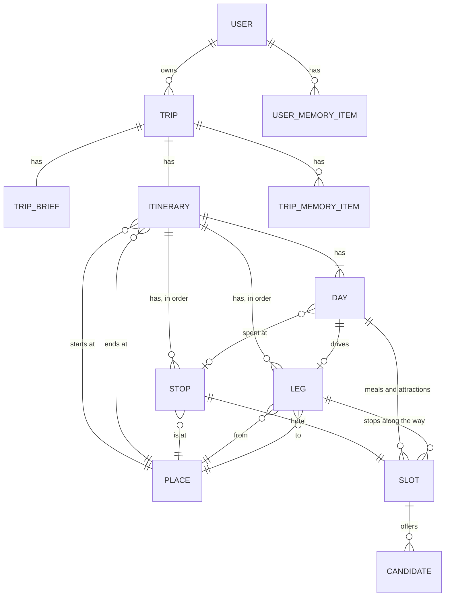

# Road Trip Planner: Technical Specification (MVP)

This document covers how the app works under the hood. So far it covers the agents: which agents exist, what each one does, which tools each one gets, and what goes in each agent's instructions. Sessions, memory, and other parts will be added as they are designed. It is written at the level of design, not of any one SDK's configuration. For the planning behavior it implements, see the [functional spec](functional-spec.md). For the tools' data sources, see the [data sources index](data-sources.md).

---

## 1. Overview

One **coordinator** agent talks to the user for the whole trip. It sends research to **worker** subagents and keeps the conversation, the itinerary, and memory to itself.

| Agent | Talks to the user | Writes the itinerary | Writes memory | Runs |
|---|---|---|---|---|
| Coordinator | Yes | Yes | Yes | For the whole session |
| Stop researcher | No | No | No | Once per stop, in parallel |
| Leg scout | No | No | No | Once per leg, in parallel |
| Weather and clothing | No | No | No | Once per trip, after the fill round |

A worker is called like a tool. It gets a brief, does its work, and returns one result. It can't ask the user anything. If it needs a decision, it says so in its result, and the coordinator asks.

---

## 2. Decisions

- **No separate interview agent, for now.** We considered an agent that scopes the trip with the user, then hands a summary to the coordinator once and ends. Discovery and refinement mix too often for a split to pay off yet (functional spec 5.3: the user can jump around). Revisit it if the coordinator's discovery turns out weak. If it is added later, the summary it hands over is the trip brief in section 5.3, so the coordinator doesn't change.
- **Workers save candidates to a store and return a short summary.** Full place details go to the store and from there to the option cards. The coordinator sees only IDs and one line per option (section 7).
- **Mechanical feasibility checks run in code.** The itinerary write tool checks every change and returns any broken rules (section 8). The agent handles the judgment: which trade-offs to offer.
- **The coordinator resolves budget rules into a tier before briefing a worker.** A worker gets "mid-range, from rule: 2+ nights", never the rule text (section 9).

---

## 3. Data model

This section lists what gets stored, how the pieces relate, and who creates or changes each one. Fields are settled during development.

### 3.1 Entities

How to read the line ends: `||` is exactly one, `o|` is zero or one, `o{` is zero or more, and `|{` is one or more. For example, `DAY ||--o| LEG` means a day has zero or one leg, and every leg belongs to exactly one day.

| Entity | Belongs to | What it is |
|---|---|---|
| Trip | User | The container for everything below. The app creates it when the user starts a new conversation (functional spec 10.1) |
| Trip brief | Trip | The items in functional spec 5.2. Created empty with the trip |
| Itinerary | Trip | Points to a start place and an end place. Holds the stops, legs, and days. Created empty with the trip |
| Place | Itinerary, stop, or leg | A location: name, coordinates, and Google's place ID when there is one. Used for the start, the end, and each stop. On a loop, the start and end are the same place |
| Stop | Itinerary | One overnight location: its place, destination or waystation, nights, and order |
| Leg | Itinerary | The drive from one place to the next. Holds its route type (scenic or fastest), any waypoints, drive time, distance, and the route line for the UI. Also holds any approved exceptions (section 8) |
| Day | Itinerary | One calendar day: date, location, rest day or not, and three time blocks |
| Slot | Stop, day, or leg | One thing to choose. A stop has a hotel slot. A day's time blocks hold meal and attraction slots. A leg holds slots for stops along the way. Each slot has a status (empty, proposed, or selected), and a tier and rule for hotels and meals |
| Candidate | Slot, in the candidate store | One option offered for one slot (section 7) |
| Trip memory item | Trip | One free-text note (functional spec 10.2) |
| User memory item | User | One standing preference (functional spec 10.3) |

**Each driving day has exactly one leg.** Stops are overnight locations, so every leg starts one morning and ends that night. A day with no leg is a rest day or a day exploring a destination.

### 3.2 Who creates and changes what

- **The coordinator,** through its tools: the trip brief, stops, legs, each day's layout, approved exceptions, memory, attaching candidates to slots, and selections.
- **Code inside the tools:**
  - Days, created from the stops and their nights.
  - Hotel slots, created when a stop is added.
  - Meal and attraction slots, created when the coordinator lays out a day's blocks.
  - A leg's drive time, distance, and route line, computed whenever a leg is added or changed. The coordinator's own routing tool is for rough checks, such as the shape sketches (4.2).
  - Feasibility results (section 8).
- **Workers:** candidates only. A worker gets slot IDs that already exist, writes candidates tagged with those IDs, and never touches the itinerary.
- **The UI:** nothing directly. A card click becomes a message to the coordinator (7.2).

**Candidates never change after they're written.** "More options" writes new candidates. It doesn't edit old ones.

### 3.3 What happens when something changes

The itinerary tools carry changes through, so the coordinator doesn't have to:

- **A stop moves to a different place:** its hotel slot goes back to empty. The legs on either side are re-routed.
- **A stop's nights change:** days are added or removed. Slots on removed days go away.
- **A stop is removed:** its slots go away, and the legs on either side become one new leg.

Candidates for slots that went away stay in the store, no longer attached to anything. The coordinator then sends new briefs for any slots that are empty.

---

## 4. How a trip is planned

### 4.1 Anchors and stretches

Every trip has **anchors**: start, end, must-sees, and sometimes a named road. Between two anchors is a **stretch**. On each stretch, one of two things is fixed:

- **The road is fixed.** Example: Pacific Coast Highway. The agent finds stops along it, using the along-leg place search.
- **The places are fixed.** Example: Texas barbecue. The agent picks the towns first, then works out the route, using region place search and the routing tool's stop ordering.

The coordinator decides which kind each stretch is during discovery and records it in trip memory. One trip can mix both.

### 4.2 Rounds

Planning goes from broad to narrow. This is the usual order in which the coordinator works through the planning activities in functional spec 5.3. The user can still move to any of them at any time.

1. **Discovery.** The coordinator establishes the items in functional spec 5.2, a few questions at a time.
2. **Shape.** The coordinator offers two or three sketches of the trip in plain chat. Each sketch is a name, the rough path, and a few sentences on why someone would pick it. Example: "A loop out of Austin through the Hill Country, 7 days" vs "One-way from Dallas to Houston, through Lockhart and Taylor."
   - Sketches come from the model's own knowledge, not from research. The coordinator makes one routing call per sketch to get a rough total drive time, so it doesn't pitch a trip that can't work.
   - Seasonal closures and hazards at this stage also come from the model's own knowledge. Workers confirm them later with real data.
   - Skip this round when the user already gave a fixed route.
3. **Skeleton.** For the chosen shape: stops, destination or waystation, nights per stop, legs with drive times, and dates if only a window was given. The coordinator builds this itself with the routing and place tools, and writes it to the itinerary.
4. **Fill.** The coordinator briefs one stop researcher per stop and one leg scout per leg, all at once. When they return, it attaches their candidate sets to itinerary slots as proposed options.
5. **Weather and clothing.** After the fill, because clothing advice depends on the planned activities.
6. **Refine.** Changes from chat or option card actions. "More options", "Higher tier", and "Lower tier" each send one stop researcher for that one slot.

---

## 5. Coordinator

### 5.1 Tools

- **Itinerary:** read the itinerary. Write changes to stops, legs, days, slot assignments, and selections. Lay out a day's blocks. Every write returns the feasibility check results (section 8).
- **Trip brief:** read the trip brief, and update an item in it. Every update returns the feasibility check results (section 8), since items like max driving hours affect them.
- **Memory:** read, add, update, and forget items in user memory and trip memory.
- **Candidate store:** read a candidate's full record by ID, when the short line isn't enough (7.2).
- **Places:** find a named place (to resolve a town or a must-see).
- **Routing:** compute a route, with stop ordering. Returns times and distances only. The route line goes to the UI.
- **Workers:** call the stop researcher, leg scout, and weather and clothing workers.

The coordinator has no place search for hotels, restaurants, or attractions, and no web search. That work belongs to workers, which keeps place results out of the coordinator's context.

### 5.2 Instructions

The coordinator's instructions cover:

- **Conduct** (functional spec 5.4): explain trade-offs plainly, never say or imply anything is booked, stay on trip planning.
- **What to establish** (functional spec 5.2), and to confirm values from user memory instead of asking again.
- **Memory precedence** (functional spec 10.4): the current conversation, then trip memory, then user memory. When the user contradicts user memory, ask whether it applies to this trip only.
- **The planning method:** anchors and stretches (4.1) and the rounds (4.2).
- **When to send work to a worker,** and how to write a brief (5.3).
- **How to handle broken feasibility rules** (functional spec 6.2): say which rule fails and by how much, then offer two or three trade-offs.
- **Budget tiers:** how to turn the user's rules into a tier per slot (section 9).

### 5.3 Trip brief and worker briefs

The coordinator keeps the **trip brief** (functional spec 5.2) current with the trip brief tools (5.1).

A **worker brief** is the part of the trip brief one worker needs:

- The slot IDs to fill, and the stop, day, or leg they belong to, with its dates, nights, and stop type
- The slots to fill, each with its resolved tier and the rule that produced it
- Interests, must-sees, and meal preferences that apply here
- Places to leave out: options already shown for the slot, and rejected options with the reason ("no parking")
- The worker's tool-call limit (section 6.4)

Workers never see raw user memory or anything about the user beyond the brief.

---

## 6. Workers

### 6.1 Stop researcher

Finds candidates for one stop's hotel, meals, and attractions.

- **Tools:** place search (hotels, restaurants, attractions near a point), the NPS tools (find the park, park conditions, things to see), and web search, both general and limited to Atlas Obscura.
- **Instructions:** fit candidates to the brief's interests and tiers. Three options per slot (functional spec 7.5). Attractions carry a visit time, labeled as an estimate when it doesn't come from NPS. Check hours against the dates, and say plainly when hours are unconfirmed. The web search rules from the [web search design](data-sources-web-search.md) apply.
- **Returns:** per slot, the candidate IDs with one line each, plus any problems found. Example: "Must-see is closed on these dates."

### 6.2 Leg scout

Finds notable stops along one leg.

- **Tools:** the along-leg place search, and web search limited to Atlas Obscura for towns the leg passes through.
- **Instructions:** fit stops to the brief's interests. Give each one's detour time, labeled as a rough figure.
- **Returns:** candidate IDs with one line each.

### 6.3 Weather and clothing

Writes weather and clothing guidance per stop (functional spec 8).

- **Tools:** the Google Weather forecast for dates within 7 days, the Open-Meteo seasonal averages tool otherwise, and NPS park conditions for alerts within 7 days.
- **Instructions:** label each stop as forecast or seasonal averages. Tie clothing advice to the planned activities in the brief. Short advice, not a packing list.
- **Returns:** the per-stop weather and clothing text, which is small. The coordinator writes it to the itinerary.

### 6.4 Rules for all workers

- **A tool-call limit per brief.** Google's free tier is about 33 rated place searches a day (Google design, section 5). The limit is a setting.
- **No user contact and no memory access.** A question for the user goes in the result.
- **Candidates go to the store, not into the result** (section 7).

---

## 7. Candidate store

Workers write each candidate to the store. Each record holds:

- A unique candidate ID (7.1)
- The full place details the tool returned (Google design, section 6), including Google's place ID when there is one
- Tier, and the rule that produced it
- **Rationale:** one or two sentences on why it was picked, tied to the user's preferences. The UI shows it as a tooltip on the option card. The coordinator reads it when the user asks "why that one?"
- Source link and notes (functional spec 7.5)

The coordinator attaches a candidate set to an itinerary slot. The UI reads the full records from the store to draw the option cards. Selected candidates keep their rationale and source (functional spec 7.6).

### 7.1 Candidate IDs

- **The store gives each candidate a unique ID,** such as a UUID. It is unique across all trips, so Austin's hotel options can never be confused with Dallas's.
- **A candidate ID is not a place ID.** A candidate is one place offered for one slot, with its own tier and rationale. The same hotel can be a candidate on two trips. Google's place ID stays in the record, and is used to leave out places the user has already seen.
- **Users never see IDs.** They refer to a place by name ("the Van Zandt") or position ("the second one"). The coordinator maps that to an ID. Each slot keeps its options in order, so "the second one" has one meaning.
- **Tools reject bad IDs.** An ID that doesn't exist, or that belongs to a different slot, returns an error. The tool never guesses.

### 7.2 What the coordinator sees

The coordinator never sees full place records, such as hours tables, coordinates, review links, and long summaries. It does see each place's name and a short line about it, so it can follow the conversation when the user names a place.

- **Worker results:** each option's line includes its ID, name, and gist. Example: "Hotel Van Zandt, mid-range, 4.6 stars, on Rainey Street, walkable to the barbecue spots."
- **Option card actions:** a Select click reaches the coordinator as a message with the same line, not only the ID. Example: "User selected Hotel Van Zandt for the Austin hotel." The coordinator then calls the select tool and confirms in chat (functional spec 7.5).
- **Reading the itinerary:** the read tool returns the name and line for every selected and proposed item, with proposed options in card order. In a new session (functional spec 10.1) this is all the coordinator knows about the trip's places.
- **Anything more,** such as "is it open Mondays?", comes from reading the full record from the store by ID.

---

## 8. Feasibility checks in code

The itinerary write tool runs these checks after every change and returns a list of broken rules:

- **Trip length:** 14 days or fewer. A hard limit, with no exceptions.
- **Daily driving:** road time plus a buffer for fuel, meals, and stops fits the user's max hours. The buffer is a setting. Max hours is a preference, so a leg can have an approved exception (below).
- **Opening hours:** each scheduled attraction and meal is open during its time block, using the weekly hours stored with the candidate. This is not a preference. A closed place is always flagged.
- **Route type:** each leg's route type matches the trip brief's route preference. Also a preference, so a leg can have an approved exception.

**Exceptions** (functional spec 6.2). An exception is not an entity. It is a set of properties on the leg, since each driving day has exactly one leg:

- **Approved drive hours:** empty unless the user agreed to a longer day.
- **Approved route type:** empty unless the user agreed to a route type other than the default.
- **Reason:** why the user agreed.

The checks compare against the approved value when there is one, and the trip brief's default when there isn't. The default lives only in the trip brief, so changing it there applies to every leg at once.

Storing the approved value, instead of a yes or no flag, means nothing has to be reset. Example: the user approves 6 hours on the last day. If a later change makes that day 7 hours, it is over 6, so it is flagged again. If a change makes it shorter, nothing is flagged.

**Approval goes through the coordinator.** When a check flags a leg, the coordinator offers the trade-offs in functional spec 6.2, and accepting the exception is one of them. The choice can be an option card. As with any card, the click reaches the coordinator as a message, and the coordinator sets the approved value. When the user already agreed in chat, such as "cut a day and drive it in one go," the coordinator sets it without asking again.

The checks that need judgment stay with the agent: must-sees vs days, seasonal risks, and choosing dates in a window.

---

## 9. Budget tiers

The coordinator turns the user's natural-language rules into a tier for each slot before briefing a worker. Example: the user says "value by default, mid-range for stops of 2+ nights." A 2-night stop's hotel slot is briefed as "mid-range, from rule: 2+ nights." The worker searches at that tier and stores the tier and rule with each candidate. That is where the card's "which rule produced it" comes from (functional spec 7.1).

---

## 10. Open questions

1. **Brief and result formats.** Section 4.3 lists the contents, not the exact fields. Settle them during development.
2. **Tool-call limits.** The numbers per worker, given the daily Google limits.
3. **A reviewer.** A later worker that reads the finished itinerary with fresh eyes and checks it against the trip brief. Not in the MVP.
4. **An interview agent.** See section 2.
5. **Day trips from a stop.** Staying in Moab and driving to Arches is not a leg, so its drive time isn't checked. Decide whether it needs to be.
